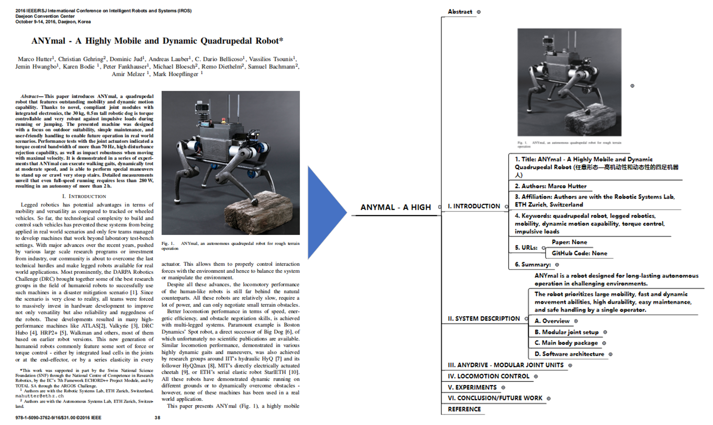

# ChatPaper2XMind

**中文**|[English](README_en.md)

ChatPaper2XMind论文XMind笔记生成工具：使用ChatGPT将PDF转换为带有图片和公式的简洁XMind笔记，提高阅读效率。

# 功能展示

# 安装与使用
环境设置
```
pip install -r requirements.txt
git submodule update --remote --recursive
```
将PDF论文转换为XMind
```
cd <root-dir>
python paper2xmind.py --path <pdf路径或pdf文件夹路径>
```
运行演示
```
python paper2xmind.py
```

# 未来工作
- 减少GPT请求次数以加快XMind生成速度
- 添加元数据和资源解析功能
- 使用PDFfigures 2.0实现图片检测
- 改进图像定位方法（由于部分匹配失败导致的图像丢失）
- 添加Markdown笔记生成功能
- 优化公式检测（边界检测）

# 鸣谢

感谢以下项目对本项目的宝贵贡献：

- [PDFfigures 2.0](https://github.com/allenai/pdffigures2)
- [Chatpaper](https://github.com/kaixindelele/ChatPaper)
- [xmind](https://github.com/zhuifengshen/xmind)

以及其他不小心被忽略的项目 :)

特别感谢开源社区和所有为该项目作出贡献的贡献者。