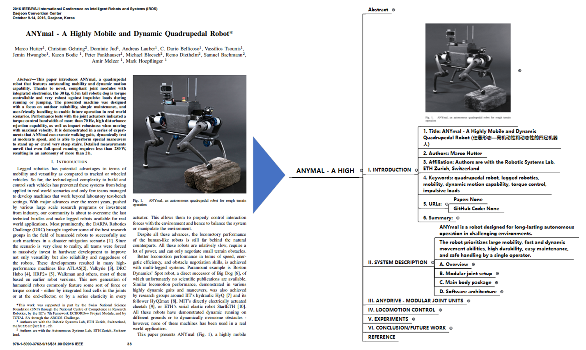

# ChatPaper2XMind

[中文](README.md) | **English**

ChatPaper2XMind is a tool for generating concise XMind notes from PDF papers using ChatGPT, including images and formulas, to improve reading efficiency.

## Functionality Showcase


## Installation and Usage
### 1. Environment Setup
```
cd <root-dir>
pip install -r requirements.txt
git submodule update --init --recursive
```

### 2. Config Configuration

Basic Settings

- **APIKEY Setup (required)**: Add APIKEYs to `config.py` (supports multi-threaded requests).
- GPT Model Selection: Set the MODEL variable in `config.py` to the desired model. Currently, "GPT-3.5-turbo" model is available.
- Language Setting: Set the LANGUAGE variable in `config.py` to select the language of the model. The default is English, but partial support for Chinese is available.
- Domain Keyword: Set the KEYWORD variable in `config.py` to specify the domain keyword that the model should focus on.
- Proxy Setup: Set the PROXY variable in `config.py` to specify the proxy address. **If your system has a global proxy set, you can leave it as None**.

Multi-threading

- Thread Request Rate Limit: Set the THREAD_RATE_LIMIT variable in `config.py` to specify the number of requests each APIKEY can send per minute. Due to OpenAI's limitations, each APIKEY can support up to 3 requests.

Generation Settings

- Max Generation Items: Set the TEXT2LIST_MAX_NUM and TEXT2TREE_MAX_NUM variables in `config.py` to specify the maximum number of items for text-to-list and text-to-tree conversions, respectively.

Enable Real GPT

- Using Real GPT Model: Set the GPT_ENABLE variable in `config.py` to use real GPT/fake GPT.
- Fake GPT Model Response: Set the FAKE_GPT_RESPONSE variable in `config.py` to specify the response content of the fake GPT model.

### 3. Getting Started

Convert PDF papers to XMind
```
cd <root-dir>
python paper2xmind.py --path <pdf_path_or_folder_path>
```
Run the demo
```
python paper2xmind.py
```

## Future Work
- Reduce GPT requests to speed up XMind generation.
- Add metadata and resource parsing capabilities.
- Implement image detection using PDFfigures 2.0.
- Improve image positioning methods (to address image loss due to partial matching failures).
- Add functionality for generating Markdown notes.
- Optimize formula detection (boundary detection).

## Acknowledgements

Thanks to the following projects for their valuable contributions to this project:

- [PDFfigures 2.0](https://github.com/allenai/pdffigures2)
- [Chatpaper](https://github.com/kaixindelele/ChatPaper)
- [xmind](https://github.com/zhuifengshen/xmind)

And all other projects that might have been inadvertently overlooked :)

Special thanks to the open-source community and all contributors who have contributed to this project.

## License
This project is released under the MIT License. For more information, see the [LICENSE](LICENSE) file.

## Author
Master Yip

Email: 2205929492@qq.com

GitHub: [Master Yip](https://github.com/MasterYip)